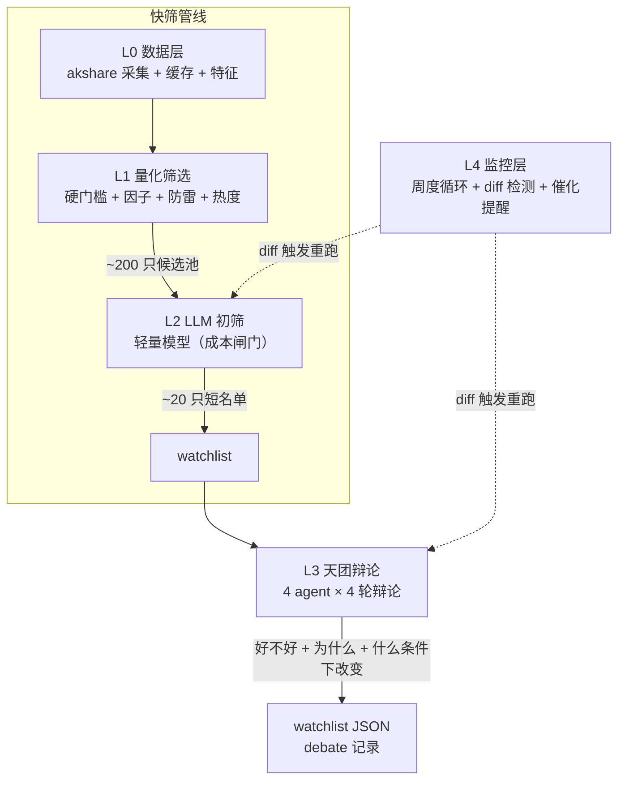

# trade-agent

> A 股价值投资选股 + 多 agent 研判系统

借鉴 [UZI-Skill](https://github.com/) 的数据采集层，用「投资大师天团」多 agent 辩论替代传统规则引擎决策层，构建从量化快筛到深度研判再到持续监控的完整选股管线。

核心理念：**选股 = 快筛（低成本广覆盖）+ 深研（高成本深研判）+ 监控（持续跟踪已入选标的）**，三者是三条独立管线，通过 watchlist 接口解耦连接。详见 `design/total-design.md`。

## 架构总览



| 层 | 模块 | 职责 |
|---|---|---|
| **L0 数据层** | `value-screener/data/` | akshare 多维度数据采集（行情/基本面/估值/风险）、缓存、~108 标准化特征 |
| **L1 量化筛选** | `value-screener/screener/` | 全市场 A 股 → ~200 只候选池：硬门槛 + 因子评分 + 防雷 + 热度过滤 |
| **L2 LLM 初筛** | `value-screener/scout/` | 候选池 → ~20 只短名单，轻量模型批量初筛，**成本闸门**（AD-03） |
| **L3 天团辩论** | `value-screener/council/` | 4 投资大师 agent × 4 轮辩论 → 仓位决策前置判断 |
| **L4 监控** | `value-screener/monitor/` | 周度主循环、watchlist 聚合、diff 检测、催化提醒 |
| **部署** | `value-screener/Dockerfile` | 单服务 + bind mount 三卷 + `.env` 注入 LLM 凭据 |

### L3 天团辩论机制

天团由 4 位风格迥异的投资大师 agent 构成——**巴菲特 / 芒格 / 段永平 / 冯柳**，外加 DA（魔鬼代言人）和 Synthesizer（综合者）。4 轮辩论设计：

| 轮次 | 机制 | 信息可见性 |
|---|---|---|
| R1 独立研判 | 各 agent 各自分析 | 隔离，互不可见 |
| R2 交叉辩论 | 针对他人 R1 质疑 | 可见他人 R1 |
| R3 DA 质询 | 魔鬼代言人挑刺 | 可见 R1 + R2 |
| R4 收敛综合 | Synthesizer 收敛结论 | 可见 R1-R3 |

**不使用 AgentScope / LangGraph 等 multi-agent 框架**（AD-05）：天团辩论本质是「带上下文的串行 LLM 调用」，`council/debate.py` 是唯一的消息总线和状态持有者，4 轮并发靠 `asyncio.gather` + 信息可见性控制实现，无框架依赖。

## 仓库结构

```
trade-agent/
├── design/                          # 设计文档（第一参考源）
│   ├── total-design.md              #   当前设计稿：第一性原理 + 目标架构 + 实施路径
│   ├── architecture-decisions.md    #   架构决策记录 AD-01 ~ AD-09
│   ├── prd-rule&case.md             #   RULE.md 分层体系 + 历史案例库 PRD
│   └── deviation-analysis-*.md      #   开发偏移记录与纠偏优先级
├── value-screener/                  # 已落地的实现
│   ├── data/        # L0 数据层（fetchers / lib / cache）
│   ├── screener/    # L1 量化筛选
│   ├── scout/       # L2 LLM 初筛
│   ├── council/     # L3 天团辩论
│   ├── monitor/     # L4 监控
│   ├── scripts/     # 分析与复现脚本
│   ├── tests/       # pytest 测试套件
│   ├── cli.py       # CLI 入口（typer）
│   ├── Dockerfile & docker-compose.yml
│   └── .env.example # LLM 环境变量模板
├── openspec/                        # OpenSpec 变更工作区（8 个 archived change）
├── uzi-skill/                       # 借鉴资产：开源股票分析 Claude plugin（独立 git 仓库，只读）
├── old-archive/                     # 初版产品构想草稿（只读）
└── CLAUDE.md                        # 项目上下文与开发约定（agent 必读）
```

## 快速开始

### 前置要求

- Python 3.13+
- Docker + Docker Compose（推荐运行方式）
- 一个 OpenAI 兼容的 LLM API（如 DeepSeek、OpenAI）

### 配置环境变量

```bash
cd value-screener
cp .env.example .env
# 编辑 .env 填入真实凭据：
#   LLM_API_KEY        — LLM API 密钥
#   LLM_API_BASE       — OpenAI 兼容 API base URL
#   LLM_MODEL          — L2 轻量模型（如 gpt-4o-mini）
#   LLM_MODEL_HEAVY    — L3 R1-3 重度推理模型
#   LLM_MODEL_MODERATE — L3 R4 收敛模型
```

`.env` 不会进 git，`docker-compose.yml` 用 `${VAR:?err}` 语法做 fail-fast 校验——缺失任一变量时 compose 会在启动前报错。

### Docker 运行

```bash
cd value-screener

# L1 量化筛选：全市场 → ~200 只候选池
docker compose run --rm value-screener screen --output data/l1_full.json

# L2 LLM 初筛：~200 只 → ~20 只短名单
docker compose run --rm value-screener scout --input data/l1_full.json --output data/l2_full.json

# L3 天团辩论：单股深研（--calibrate 可跑校准测试）
docker compose run --rm value-screener council --ticker 600519

# L4 周度监控主循环
docker compose run --rm value-screener monitor weekly
docker compose run --rm value-screener monitor watchlist
```

产出直接落宿主 `data/`、`watchlist/`、`debate/` 三个 bind mount 目录，无需 `docker cp` 即可查看。

### 本地运行（无 Docker）

```bash
cd value-screener
python -m venv .venv && source .venv/bin/activate
pip install -r requirements.txt

export $(grep -v '^#' .env | xargs)   # 加载环境变量
python cli.py screen --output data/l1_full.json
python cli.py council --ticker 600519
```

### CLI 子命令一览

| 命令 | 说明 |
|---|---|
| `fetch` | 采集单只股票单维度数据 |
| `batch` | 从文件读 ticker 列表，批量采集全维度 |
| `cache-clear` | 按 ticker/dim 清理缓存 |
| `screen` | L1 量化筛选（`--debug` 输出漏斗中间统计） |
| `scout --input <L1.json>` | L2 LLM 初筛（`--force` 跳过缓存） |
| `council --ticker <code>` | L3 天团辩论（`--calibrate` 跑校准，`--force` 重跑） |
| `monitor weekly` | L4 周度主循环（`--force-l2` / `--force-l3` 强制重跑） |
| `monitor watchlist` | 查看最新或指定日期 watchlist |

## 当前状态

L0→L4 全流程骨架已落地，8 个 OpenSpec change 全部 archived，有真实数据缓存与 debate/watchlist 产出文件。

| 维度 | 状态 | 说明 |
|---|---|---|
| L0-L4 实现 | ✅ 骨架完成 | 各层模块、CLI、Docker 部署均已落地 |
| 测试 | ✅ 套件完备 | ~26 个 pytest 测试覆盖各层 |
| 端到端实跑 | ⚠️ 待验证 | 全天团端到端实跑尚未验证，存在 L3 R1 串台/同质化 bug 待修 |
| 前端 | ❌ 未落地 | total-design §8 规划的 Streamlit 前端未创建 |
| RULE.md 三层 | ❌ 未落地 | 全局/项目/agent 三层规则继承体系为设计目标，agent prompt 当前内联在 `council/prompt.py` |

动手前必读：`design/total-design.md`（第一参考源）、`design/architecture-decisions.md`（AD-01 ~ AD-09）、`design/deviation-analysis-2026-07-01.md`（偏移记录与纠偏优先级）。

## 核心架构决策

| 编号 | 决策 | 要点 |
|---|---|---|
| AD-01 | 两条独立管线 | 快筛与深研解耦，通过 watchlist 接口连接 |
| AD-02 | 「不择时」修正 | 本系统不预测买卖时点，只判断标的「好不好」 |
| AD-03 | L2 成本闸门 | 200 只全丢 L3 不可承受，L2 用轻量模型拦截 |
| AD-04 | LLM 推理等级 | 重度（R1-3）/ 中度（R4）/ 轻量（L2）三档映射 |
| AD-05 | 不用 multi-agent 框架 | 串行 LLM 调用 + asyncio.gather，无框架依赖 |
| AD-06 | MVP 不做回测 | 先验证研判增量，系统性回测后置 |
| AD-07 | 格雷厄姆在 L1 内核 | 安全边际规则在量化筛选层，不在天团 |
| AD-09 | L3 拆分以辩论增量为 gate | 从单 agent 起步验证辩论增量再扩展 |

完整决策记录见 `design/architecture-decisions.md`。

## 测试

```bash
cd value-screener
source .venv/bin/activate    # 或 docker compose run --rm value-screener pytest
pytest
```

测试覆盖 screener、scout、council（agents/debate/prompt/schema/calibrate/watchlist）、monitor、cli 各子命令及 R1 特征溯源等。

## 项目治理

变更走 [OpenSpec](https://github.com/) 流程（根 `openspec/`）：`propose` → 实现 → `archive`。已有 8 个 archived change：

- `l0-bootstrap-data-layer`
- `l1-quantitative-screener`
- `l2-llm-scout-agent`
- `l3-council-foundation`
- `l3-full-analyst-council`
- `l4-monitoring-layer`
- `l4b-docker-run`
- `f1-deviation-fix`

新 change 的 proposal/design 必须引用 AD 记录而非重复搬运架构决策。状态查询 `openspec list --json`。

## 开发约定

- 设计 / 讨论用**中文**；代码标识符、库 API、提交信息跟随子项目惯例
- 修改代码前，先说明计划；阅读、评审或问答不需要修改计划
- 不主动引入新依赖，不重构无关文件
- 前端组件需考虑 loading / empty / error 三态
- 修改完成后优先运行 lint 和相关测试
- 借鉴 UZI 模式时同步修工程债，不把脏代码带过来

详见 `CLAUDE.md` 与 `AGENTS.md`。

## 致谢

数据采集层借鉴开源项目 [UZI-Skill](https://github.com/)（v3.9.0，A 股深度分析 Claude plugin）的采集 / 容错 / 并发 / 特征层设计，决策层（投资大师天团）为本项目原创。
